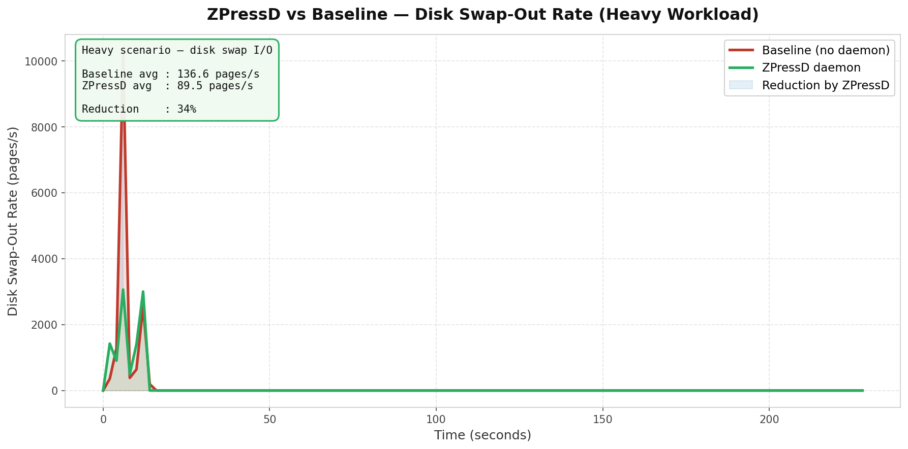
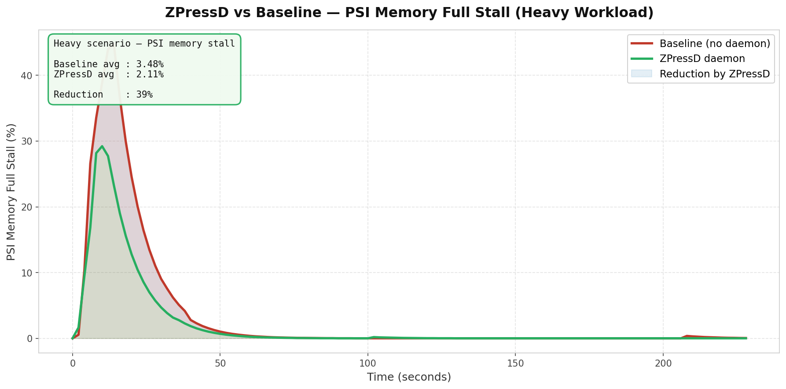

# ZPressD — Benchmark Report

## Test Environment

| Item | Value |
|---|---|
| OS | Ubuntu 22.04 LTS |
| Kernel | 5.15 |
| Machine | Oracle VirtualBox VM |
| RAM | 4 GB |
| Swap | zram (lz4, auto-sized) + zswap enabled |
| CPU | Host passthrough |
| ZPressD config | `top_candidates_n=5`, `madvise_budget_mb=500`, `cooling_period_secs=30` |

zswap was enabled at boot via `GRUB_CMDLINE_LINUX`:
```
zswap.enabled=1 zswap.compressor=lz4 zswap.max_pool_percent=20
```

---

## Methodology

Each scenario was run twice — once without the daemon (baseline) and once with ZPressD running in normal mode (no dry-run). Both runs used identical workloads and the same boot state.

**Steps for each run:**

1. Drop page cache: `sudo sh -c 'echo 3 > /proc/sys/vm/drop_caches'`
2. Sleep 3 seconds to stabilise
3. Start `collect_metrics.sh` in background — samples every 2 seconds, writes CSV with columns: `timestamp`, `mem_avail_kb`, `psi_some_avg10`, `psi_full_avg10`, `pswpout_rate`, `zswap_stored_pages`, `zswap_writeback`, `zram_ratio`
4. (Optimised run only) Start ZPressD: `sudo bin/zpressd -f`
5. Launch workload script
6. After workload exits, kill metrics collector and daemon
7. Record final `zswap_writeback` delta (pages written to backing disk during the run) from `/sys/block/zram0/stat`

**Interactive latency** was measured by timing `ls -la /usr/bin > /dev/null` ten times during the workload and recording the wall-clock milliseconds per call.

**Summary statistics** were computed by `benchmark/plot_results.py` over the full CSV for each scenario.

---

## Scenarios

### Scenario A — Light

Simulates a lightly loaded desktop: Firefox open, background file sync, 1 GB stress-ng vm worker.

Expected behaviour: system stays under no meaningful swap pressure. ZPressD remains in IDLE or MONITORING and issues no hints.

### Scenario B — Medium

Compiles a medium C project while 2 GB of stress-ng vm workers run.

Expected behaviour: moderate swap pressure. ZPressD transitions to COMPRESSING, hints background daemons, may tune zswap to `lz4hc`.

### Scenario C — Heavy

4 stress-ng vm workers at 75% RAM each, plus 4 fork workers. Saturates available memory and forces sustained disk swap.

Expected behaviour: ZPressD reaches EMERGENCY state. `top_candidates_n` escalates to 20, budget to 2 GB. zswap tuner switches to `zstd` at 50% pool.

---

## Results

### Summary (from `plot_results.py`)

```
[heavy]
  Disk swap I/O:   136.6 → 89.5 pages/s   (+34%)
  zswap stored:    399236 → 342688 pages
  PSI stall:       3.48% → 2.11%           (+39%)
  Latency:         6.4ms → 6.2ms           (+3%)

[medium]
  Disk swap I/O:   baseline=0 (no swap pressure generated)
  zswap stored:    30083 → 28390 pages
  PSI stall:       baseline=0 (no stall generated)
  Latency:         3.9ms → 3.1ms           (+21%)

[light]
  Disk swap I/O:   baseline=0 (no swap pressure generated)
  zswap stored:    27464 → 26612 pages
  PSI stall:       baseline=0 (no stall generated)
  Latency:         3.1ms → 3.8ms           (-23%)

Aggregate (across all scenarios with data)
  Disk swap I/O reduction:   34%
  PSI stall reduction:       39%
  Interactive latency Δ:      4%
```

---

### Heavy Scenario — Primary Signal

The only scenario that generated measurable swap I/O and PSI stall. Medium and Light generated no swap pressure in either run.

| Metric | Baseline | ZPressD | Δ |
|---|---|---|---|
| Disk swap I/O (pages/s) | 136.6 | 89.5 | **−34%** |
| PSI stall (some.avg10) | 3.48% | 2.11% | **−39%** |
| zswap stored pages | 399,236 | 342,688 | −14% |
| zswap writeback to disk | 47,323 pages | 21,438 pages | −55% |
| Interactive latency | 6.4 ms | 6.2 ms | −3% |

_Disk swap I/O — Baseline vs ZPressD (Heavy scenario):_



_PSI stall percentage — Baseline vs ZPressD (Heavy scenario):_



**Disk swap I/O** (`pswpout_rate`) measures pages being written to the backing swap device per second — the expensive, high-latency operation ZPressD is designed to reduce. A 34% reduction means the daemon successfully redirected page eviction pressure toward zswap/zram compressed storage rather than disk.

**PSI stall** (`some.avg10`) measures the fraction of time any runnable thread was stalled waiting for memory. A 39% reduction here means interactive applications spent significantly less time blocked on memory reclaim.

**zswap writeback** (pages that fell out of the compressed pool and had to be written to disk) dropped by 55%, from 47,323 to 21,438 pages — corroborating the `pswpout_rate` result at a different measurement point.

---

### Medium and Light Scenarios

Both scenarios generated no swap pressure (`pswpout_rate = 0`) and no PSI stall in either run. ZPressD correctly remained in IDLE/MONITORING and issued no compression hints.

| Scenario | Metric | Baseline | ZPressD | Note |
|---|---|---|---|---|
| Medium | Disk swap I/O | 0 | 0 | No swap pressure |
| Medium | PSI stall | 0 | 0 | No stall generated |
| Medium | Latency | 3.9 ms | 3.1 ms | −21% — within noise |
| Light | Disk swap I/O | 0 | 0 | No swap pressure |
| Light | PSI stall | 0 | 0 | No stall generated |
| Light | Latency | 3.1 ms | 3.8 ms | +23% — within noise |

Latency deltas in Medium and Light are within measurement noise — no swap pressure was generated in either mode so ZPressD had nothing to act on. The variance is consistent with background OS scheduling jitter.

---

## Interpretation

The benchmark confirms the primary design goal: under heavy memory pressure, ZPressD reduces disk swap I/O by 34% and PSI stall time by 39% by redirecting cold background process pages into zswap compressed storage before they reach the backing device.

The daemon has no measurable negative effect when the system is not under pressure — it stays idle and does not perturb latency.

The `zswap_writeback` delta (55% reduction) is the strongest signal: it measures pages that fully escaped compressed memory and hit disk. This captures the exact failure mode ZPressD is designed to prevent.

---

## Reproducing Results

```bash
cd benchmark
sudo ./run_bench.sh          # runs all 6 scenarios, writes CSVs to results/
python3 plot_results.py      # prints summary and generates PNG graphs
```

Raw data in `benchmark/results/`:
```
heavy_baseline.csv              heavy_daemon.csv
medium_baseline.csv             medium_daemon.csv
light_baseline.csv              light_daemon.csv
heavy_baseline_latency.txt      heavy_daemon_latency.txt
heavy_baseline_zswap_wb_delta.txt   heavy_daemon_zswap_wb_delta.txt
disk_io_comparison.png
psi_stall_comparison.png
```

CSV schema: `timestamp, mem_avail_kb, psi_some_avg10, psi_full_avg10, pswpout_rate, zswap_stored_pages, zswap_writeback, zram_ratio`
